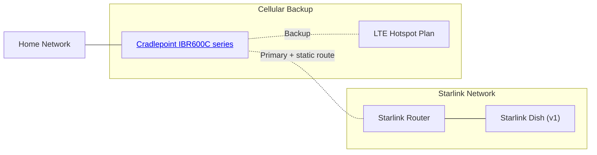

# starlink-cradlepoint-switcher

This is my personal script for adding cellular backup to [Starlink][] with a [Cradlepoint][] LTE 
router.

| :warning:    | This probably won't work for your setup |
|--------------|:----------------------------------------|

This script was written specifically for my own setup, so it is not likely to work out of the box
for anyone else.

However, you are welcome to clone/fork it and modify it to your own benefit. Specifically, while I
wrote the [cradlepoint]() package specifically for this purpose, feel free to turn it into a more
general purpose (though I'd check PyPI to make sure no one else has, first, though) 

---

## Why?

I designed this for a very specific setup.

Because of this setup, the Cradlepoint router is in control of when to use Starlink for internet,
and when to use our hotspot plan. However, I've run into two problems:

1. The Cradlepoint isn't very good at detecting when the Starlink satellite is down. It can take up 
to minutes, which is frustrating when I'm trying to work, particularly when Starlink is having
regular outages.
2. The options to try to detect it quicker completely disconnect from the Starlink router when an 
outage is detected, so I lose access to the tools to monitor for issues. They are also still kinda
slow.

## How it works

In short, this utility connects to the Starlink dish and repeatedly asks if it is connected
to any satellites. (So far, the dish has not reported it is annoyed by this.) If it says no, it 
tells the Cradlepoint router to prioritize the LTE network for traffic.

## Stack

I've written this script in Python because it's where I have the most familiarity with async. I also
previously developed a Python library for connecting to Starlink, so I'm just using that.

- [starlink-python](https://pypi.org/project/starlink-python/) - connects over gRPC
- An internally written [cradlepoint API](cradlepoint) for connecting to the router's HTTP api

I haven't figured out yet how I'm gonna deploy it.
